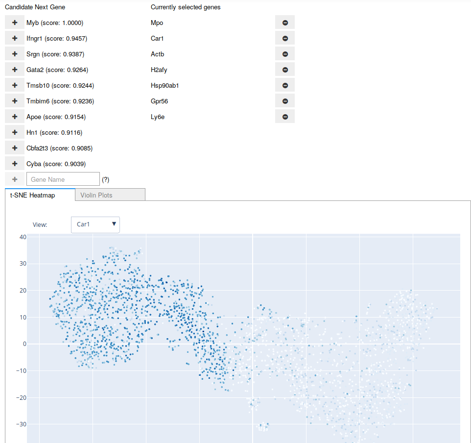
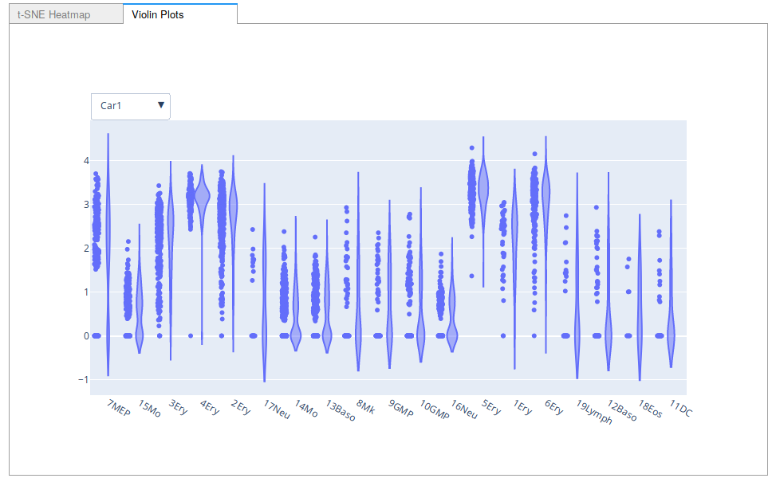

.. py:module:: picturedrocks.markers.interactive
.. currentmodule:: picturedrocks.markers.interactive

Interactive Marker Selection
----------------------------

PicturedRocks provides an interactive user interface for selecting markers that allows the practitioner to use both their domain knowledge and the information-theoretic methods to select a small set of genes.

   A screenshot of the Interactive Marker Selection user interface being used on the Paul dataset. The "candidate" genes are updated after any addition to or removal from the "current" list of genes. The user may also type in the name of a gene at any point.

   A screenshot of the violin plot option for Interactive Marker Selection.

The user can specify the tabs they want available through the `visuals` argument. It is also possible to write your own interface for a tab using any plotting library available to you. See below for more details.

.. autoclass:: InteractiveMarkerSelection
.. autoclass:: GeneHeatmap
.. autoclass:: ViolinPlot

Using Your Own Visualizations
=============================

To write your own visualization, simply extend the :class:`~picturedrocks.markers.interactive.InteractiveVisualization`. Use the source code for :class:`~GeneHeatmap` and :class:`~ViolinPlot` as a reference for implementation.

.. autoclass:: InteractiveVisualization

